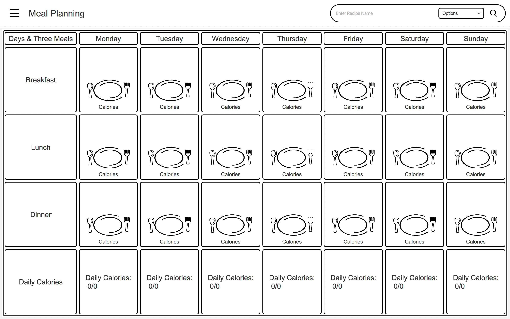

# Pantry the App
#### 2022 | Developed for CSE 201 at Miami University by the following fine people:

For CSE 201 Finals, I was the project manager and front-end of a meal management project, scraping 
recipes from the internet and serving dynamic live from local database.

Front-end in JavaFX, Back-end with Java, MySQL

